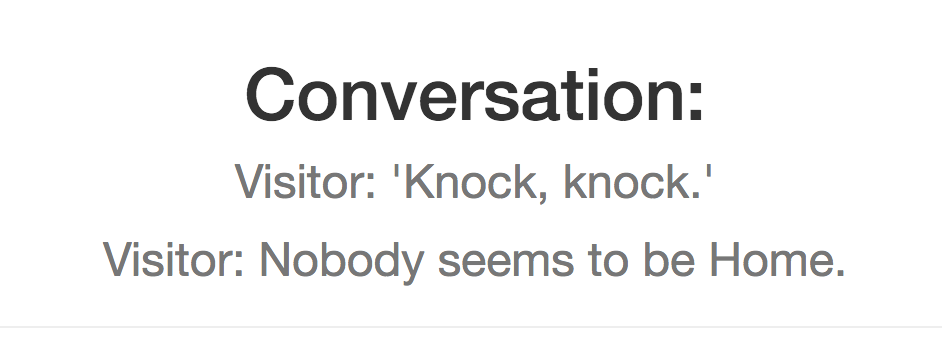
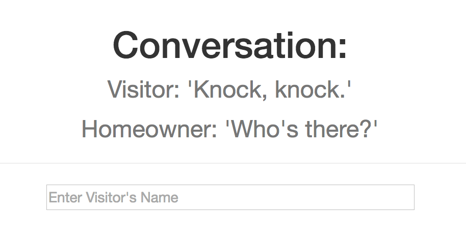

# Spring Cloud Services + Container-to-Container Networking sample

*Homeowner* and *Visitor* are example applications demonstrating the use of Service Registry and Circuit Breaker from Spring Cloud Services with Container-to-Container (C2C) Networking from Cloud Foundry.

## Building and Deploying

Using Gradle, run `./gradlew build` (OS X, Linux) or `gradlew.bat build` (Windows).

```
$ ./gradlew build
```

Run the deployment script

```
$ ./scripts/deploy_gradle.sh
```

The script will create a Service Registry service instance and then push the applications and bind them to the service.

When the script has finished, set the `TRUST_CERTS` environment variable to the API endpoint of your Elastic Runtime instance (as in `api.example.com`), then restage the applications so that the changes will take effect. Setting `TRUST_CERTS` causes Spring Cloud Services to add the the SSL certificate at the specfied API endpoint to the JVM's truststore, so that the client application can communicate with a Service Registry service instance even if your Elastic Runtime instance is using a self-signed SSL certificate (see the http://docs.pivotal.io/spring-cloud-services/service-registry/writing-client-applications.html#self-signed-ssl-certificate[Service Registry documentation]).

```
$ cf set-env homeowner TRUST_CERTS api.wise.com
Setting env variable 'TRUST_CERTS' to 'api.wise.com' for app homeowner in org myorg / space development as user...
OK
TIP: Use 'cf restage' to ensure your env variable changes take effect
$ cf restage homeowner
```

```
$ cf set-env visitor TRUST_CERTS api.wise.com
Setting env variable 'TRUST_CERTS' to 'api.wise.com' for app visitor in org myorg / space development as user...
OK
TIP: Use 'cf restage' to ensure your env variable changes take effect
$ cf restage visitor
```

**NOTE**

> By default, the Spring Cloud Services Starters for Service Registry causes all application endpoints to be secured by HTTP Basic authentication. For more information or if you wish to disable this, http://docs.pivotal.io/spring-cloud-services/service-registry/writing-client-applications.html#disable-http-basic-auth[see the documentation]. (HTTP Basic authentication is disabled in these sample applications.)

## Trying It Out

Visit `[ROUTE]/knock`, where `[ROUTE]` is the route bound to the Visitor application. The Visitor application will use the Service Registry to look up the Homeowner application and get a message back.

When the Visitor and Homeowner applications are initially deployed, the Visitor application will not be able to contact the Homeowner application. This is because a route has not been established between the applications using the https://github.com/cloudfoundry-incubator/cf-networking-release[Network Access CF CLI plugin]. The following screenshot shows an example where nobody is home due to lack of communication with Homeowner from Visitor.



Once the Network Access CF CLI plugin is installed and you have sufficient authorization, you can run the following command to allow communication between Visitor and Homeowner applications:

`cf allow-access visitor homeowner --protocol tcp --port 8080 `

Here is an example of the Visitor and Homeowner communicating successfully.



After responding in the text field what the name of the visitor is then you will be taken to the following greeting & conversation with the homeowner:


For more information about the Service Registry and its use in a client application, see the http://docs.pivotal.io/spring-cloud-services/service-registry/writing-client-applications.html[Service Registry documentation].
